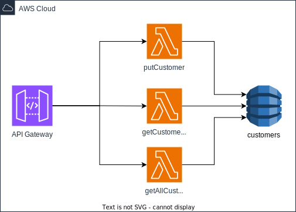

# Exemplo utilizando AWS SAM

Exemplo prático utilizando o AWS SAM - Serverless Application Model. Criando um cadastro de clientes simples e totalmente serverless utilizando os serviços: API Gateway, Lambda e DynamoDB.

## Desenho da solução


## Executando o projeto localmente

> Para executar o projeto localmente é necessário ter instalado o AWS SAM CLI e o Docker.

Após ter instalado as ferramentas necessário basta digitar o seguintes comando no terminal:

```bash
sam build
```

```bash
sam local start-api
```

```bash
curl http://localhost:3000/
```

## Deploy na AWS

Para realizar o deploy na AWS basta executar os seguintes comandos:

```bash
sam build
```

```bash
sam deploy
```

## Executando teste unitário

```bash
cd register-customer
```

```bash
npm install
```

```bash
npm run test
```

## Autor

### Nicolas Rezende